# Investments App - Financial Products Comparator


## 📖 Description

**Invest-App** is a comprehensive solution designed to centralize and compare investment rates offered by various banking entities in Colombia. The main problem this project solves is the fragmentation of financial information; users typically have to visit multiple websites to compare rates for **CDTs** (Term Deposit Certificates), **FICs** (Collective Investment Funds), and **Savings Pockets**.

This project serves as a **technical portfolio** demonstrating advanced software engineering skills in a fullstack monorepo, including:

- **Clean Architecture & Clean Code:** Strict separation of concerns and readable, maintainable code.
- **Scalability:** Implementation of Microfrontends and Serverless computing.
- **Performance:** Optimized builds and efficient data fetching.
- **Best Practices:** Comprehensive unit testing, CI/CD pipelines, and strict typing.

The system retrieves data in real-time through **Web Scraping** techniques directly from official bank sources, ensuring the veracity and currency of the data presented.

---

## 🏗 Architecture

The project is structured as a **Monorepo** containing a shared domain library, multiple backend services (APIs), and a microfrontend-based web application.

```mermaid
graph TD
    subgraph "Frontend (Angular 20 + Native Federation)"
        Shell[Shell Host]
        Home[Home Remote]
        CDT[CDT Remote]
        FIC[FIC Remote]
        Pocket[Pocket Remote]

        Shell --> Home
        Shell --> CDT
        Shell --> FIC
        Shell --> Pocket
    end

    subgraph "Shared Kernel"
        Domain[invest-domain _NPM Library_]
    end

    subgraph "Backend Services (Node.js / Azure Functions)"
        API_Ban100[invest-ban100]
        API_Bancolombia[invest-bancolombia]
        API_BDB[invest-bdb]
        API_Finandina[invest-finandina]
        API_Nu[invest-nu]
    end

    subgraph "External Bank Sources"
        Web_Ban100[Ban100 API]
        Web_Bancolombia[Bancolombia Web/PDF]
        Web_BDB[Banco de Bogotá Web]
        Web_Finandina[Finandina Web]
        Web_Nu[Nu Bank API]
    end

    CDT --> Domain
    FIC --> Domain
    Pocket --> Domain

    CDT --> API_Ban100
    CDT --> API_Bancolombia
    CDT --> API_BDB
    CDT --> API_Finandina
    CDT --> API_Nu

    FIC --> API_Bancolombia
    FIC --> API_BDB

    Pocket --> API_Finandina
    Pocket --> API_Nu

    API_Ban100 --> Web_Ban100
    API_Bancolombia --> Web_Bancolombia
    API_BDB --> Web_BDB
    API_Finandina --> Web_Finandina
    API_Nu --> Web_Nu
```



### 1. Shared Domain Library (`invest-domain`)

To ensure consistency and reusability, the core business logic is centralized in a library published to NPM `@dark-light-20/invest-domain`.

- **Entities:** Defines the interfaces for CDTs, FICs, and Pockets.
- **Use Cases:** Implements the business logic (e.g., `simulateCDT`, `getFICs`) independent of the framework.
- **Testing:** Covered by unit tests with **Jest**.

For more information, you can check its [README](./invest-domain/README.md).

### 2. Backend Services

Each bank has its own dedicated project (e.g., `invest-bancolombia`, `invest-nu`) responsible for scraping or fetching data from that specific entity.

- **Dual Runtime:**
  - **Local Development:** Implemented with **Express.js** and TypeScript for rapid iteration.
  - **Production:** Reproduction of each express API endpoint to be deployed as **Azure Functions** for a serverless, cost-effective, and scalable architecture.
- **Techniques:** Uses tools like `cheerio` for HTML parsing, `pdf2json` for PDF extraction, and direct API consumption.

### Scraping Techniques by Service

| Service              | Product | Technique                             | Tools Used               |
| :------------------- | :------ | :------------------------------------ | :----------------------- |
| `invest-ban100`      | CDT     | API Consumption                       | `fetch`                  |
| `invest-bancolombia` | CDT     | API Consumption                       | `fetch`                  |
| `invest-bancolombia` | FIC     | Web Scraping + PDF Parsing            | `cheerio`, `pdf2json`    |
| `invest-bdb`         | CDT     | API Consumption (User-Agent Rotation) | `fetch`, `@ngneat/falso` |
| `invest-bdb`         | FIC     | Web Scraping                          | `cheerio`                |
| `invest-finandina`   | CDT     | Web Scraping                          | `cheerio`                |
| `invest-finandina`   | Pocket  | Web Scraping                          | `cheerio`                |
| `invest-nu`          | CDT     | API Consumption                       | `fetch`                  |
| `invest-nu`          | Pocket  | API Consumption                       | `fetch`                  |

### 3. Frontend Application (`invest-web`)

The user interface is built with **Angular 20**, utilizing a **Microfrontend Architecture** via **Native Federation**.

- **Structure:**
  - **Shell (Host):** Handles layout and routing.
  - **Remotes:** Distinct applications for `Home`, `CDT`, `FIC`, and `Pocket`.
- **Clean Architecture in Frontend:** Each microfrontend follows a layered approach:
  - **Domain:** Models and abstract Gateways.
  - **Application:** Use Cases (Services).
  - **Infrastructure:** HTTP Adapters and concrete implementations.
  - **UI:** Standalone components and presentation logic.
- **DevOps:** Automated deployment to **Cloudflare Pages** via GitHub Actions.

For more information, you can check its [README](./invest-web/README.md).

---

## 📂 Project Structure

```text
.
├── invest-domain/          # Shared business logic (NPM Library)
├── invest-web/             # Angular Workspace Monorepo (Microfrontends)
│   ├── projects/shell      # Host Application
│   ├── projects/cdt        # CDT Remote App
│   ├── projects/fic        # FIC Remote App
│   └── ...
├── invest-bancolombia/     # Backend API for Bancolombia
├── invest-bdb/             # Backend API for Banco de Bogotá
├── invest-ban100/          # Backend API for Ban100
├── invest-finandina/       # Backend API for Banco Finandina
├── invest-nu/              # Backend API for Nu Bank
└── ...
```

---

## 🛠 Technologies

### Core

- **Language:** [TypeScript](https://www.typescriptlang.org/) (Used across the full stack)
- **Testing:** [Jest](https://jestjs.io/) (Unit tests for Domain Lib and Frontend)
  _TODO: Include tests for backend_

### Frontend

- **Framework:** [Angular 20](https://v20.angular.dev/)
- **Architecture:** Native Federation (Microfrontends)
- **Styling:** [TailwindCSS](https://tailwindcss.com/)
- **State/Async:** RxJS and Angular Signals

### Backend

- **Runtime:** Node.js
- **Server:** Express (Local), Azure Functions (Cloud)
- **Scraping:** Cheerio, PDF2JSON, Fetch API
- _Extra: **Python:** Used as a test for PDF file parsing (not currently maintained)._

### DevOps

- **CI/CD:** GitHub Actions
- **Hosting:** Cloudflare Pages (Frontend), Azure Functions (Backend)

---

## 🚀 How to Run Locally

To run the entire ecosystem locally, follow these steps:

### Prerequisites

- Node.js (v20 or higher, but v24 LTS is recommended)
- NPM

### 1. Environment Variables Configuration

In each bank API project, there is a `.env.sample` file. From this file, you must create a `.env` file where the data source values will be defined. Similarly, in each `azure-functions` subproject, the `local.settings.json` file must be defined to configure the local functions, the same environment variables, and CORS.

### 2. Run Backend APIs

You can run specific bank APIs as needed. For example, to run Bancolombia:

```bash
cd invest-bancolombia
npm ci
npm run start-dev   # If you need to make real-time changes (uses nodemon)
# or
npm run build
npm run start       # If you only need the local API to work
# or
cd azure-functions
npm ci
npm run start       # Run as Azure Functions locally
```

_Repeat for other banks (`invest-bdb`, `invest-nu`, etc.), each project is exposed on different ports._

- invest-ban100: Port 3003
- invest-bancolombia: Port 3000
- invest-bdb: Port 3001
- invest-finandina: Port 3005
- invest-nu: Port 3004

For Azure Functions, the default port 7071 is used.

### 3. Run Frontend Application

The Angular application uses Native Federation. You must start the shell and the required remotes.

```bash
cd invest-web
npm ci
npm run start shell
npm run start home
npm run start cdt
# etc.
```

_Note: Ensure that the environment files in the frontend projects point to your local backend ports._

---

## 🧪 Quality Assurance

This project emphasizes high code quality standards:

- **Unit Tests:** Run `npm run test` in `invest-web` or `invest-domain` to execute the Jest suites.
- **Linting:** Strict ESLint rules are applied to enforce code style.
- **Clean Code:** Variable naming, function modularity, and SOLID principles are strictly followed.

---

## 📄 License

This project is open source and available under the MIT License.

**Disclaimer:** This application is for educational and demonstration purposes. The data is obtained from public sources of the respective banking entities. Before making any financial decision, you should verify the information directly with the corresponding entity.
