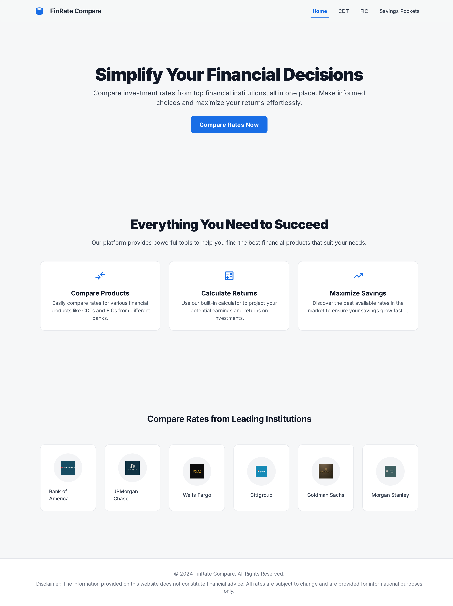
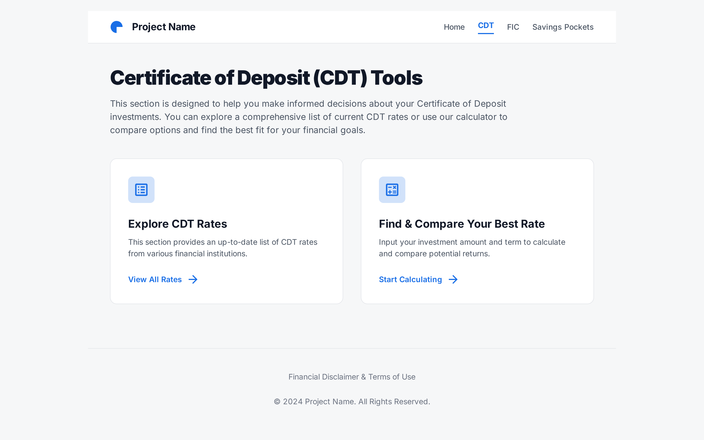
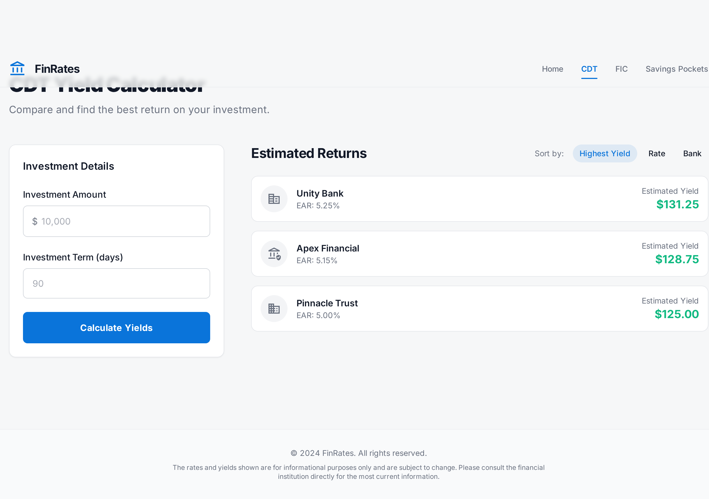
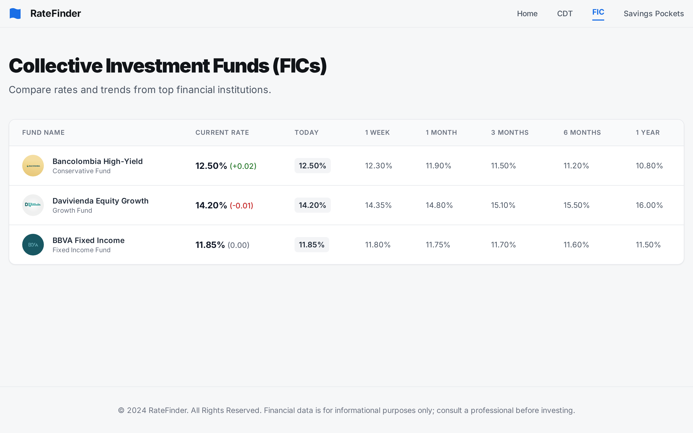
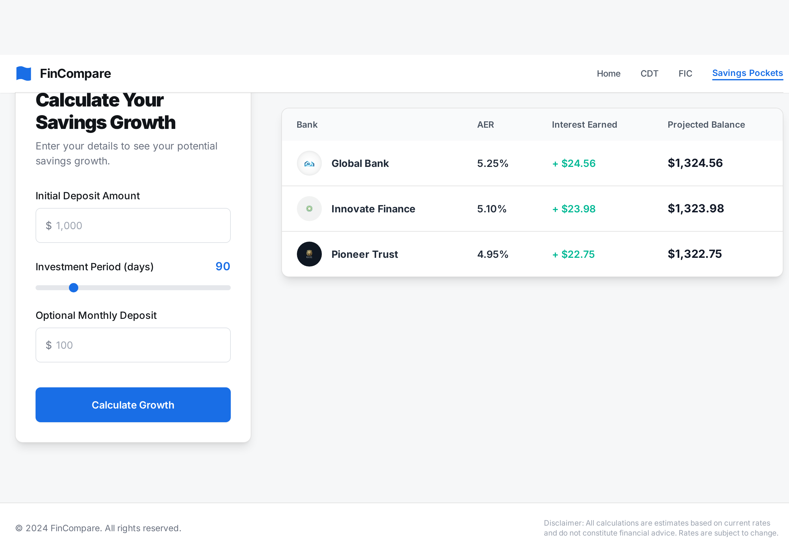
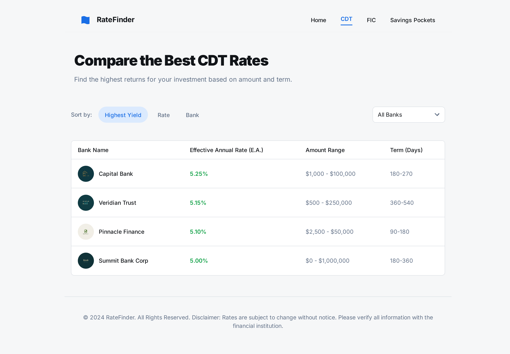
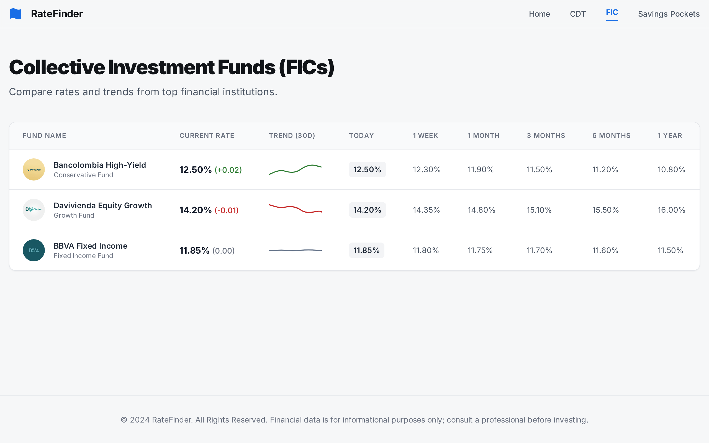
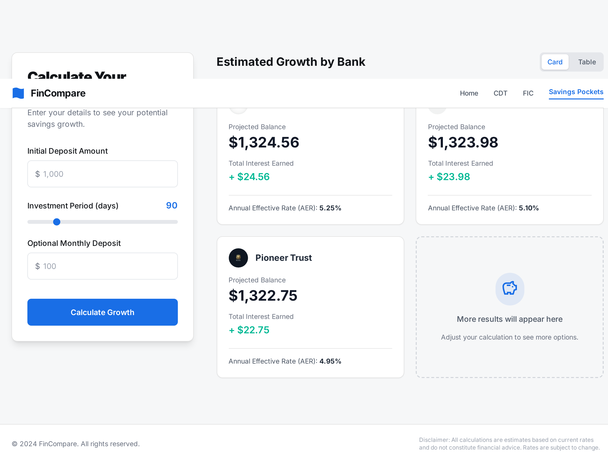

# UI Prototype

This project has a mockup prototyped with Google Stitch, composed of several screens that show the user interface of the web app.

## Screens

The mockup includes the following screens:

- Home Screen: This screen shows a summary of the app and its features.
  

  **NOTE**: The layout of the header and footer has to be based on the design shown in this screen, so it is important to ignore these sections in the next screens.

- CDT Submenu Screen: This screen allows the user to navigate to the CDT-related features.
  

- CDT Rates Screen: This screen allows the user to search for CDT rates offered by different banks.
  

- CDT Calculate Investment Screen: This screen allows the user to calculate the investment returns for a selected CDT.
  

- FIC Rates Screen: This screen allows the user to search for FIC rates offered by different banks.
  

- Pocket Simulator Screen: This screen allows the user to simulate pocket investments.
  

## Logo

The logo for the project was generated with Google Gemini:

## Future Improvements

- 404 Page screen for invalid routes

- Bank selector filter in CDT rates list screen
  

- Trend column in FIC rates list table screen
  

- Card view for Pocket simulations
  
